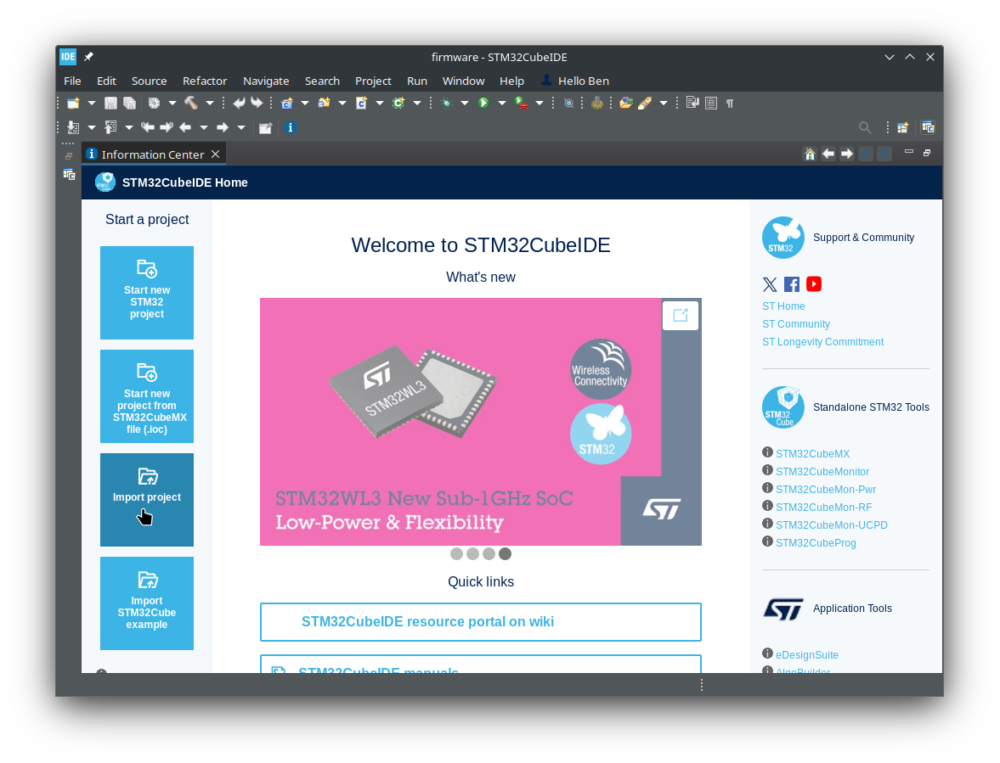
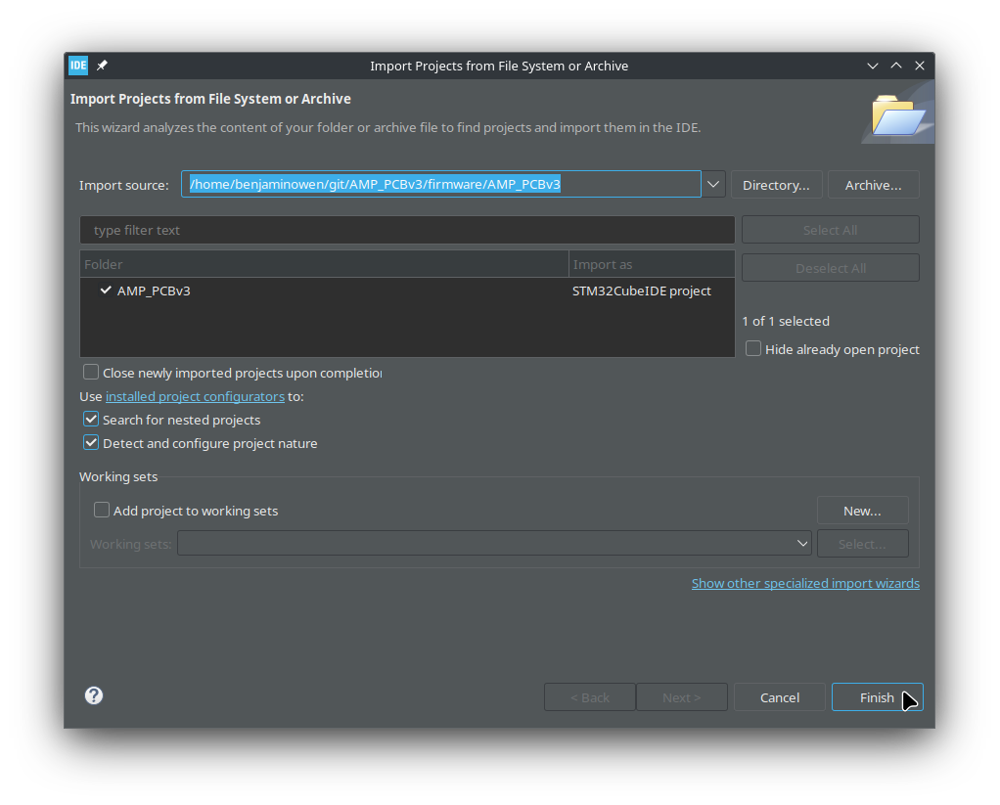
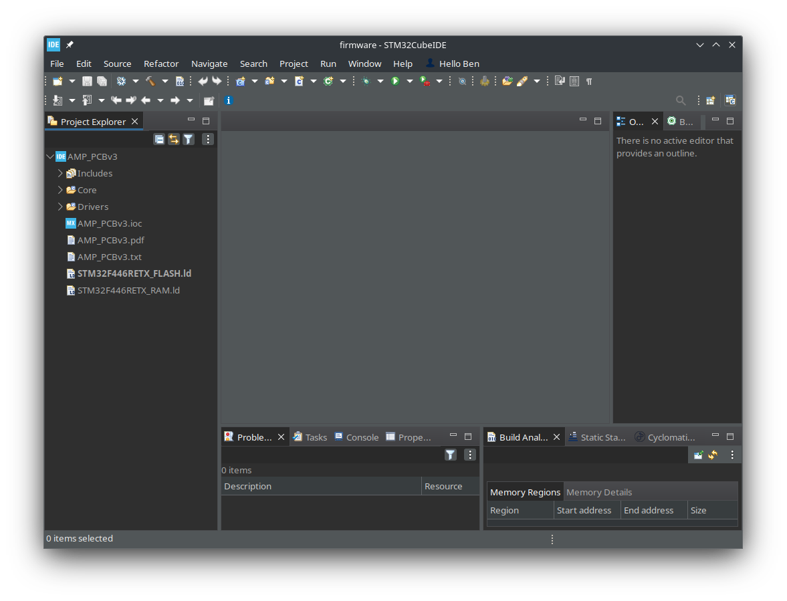

# AMP_PCBv3

Files relating to version 3 of the PCB for AMP kart

## Importing project into CubeIDE

CubeIDE files are not saved to this repository.  After first clone, you will need to import the AMP_PCBv3 project into the CubeIDE workspace.

When first opening CubeIDE, open the "firmware" folder as your workspace location (do not use the "firmware/AMP_PCBv3" folder).

Once CubeIDE loads, select the "Import project" button.

Now, select the "AMP_PCBv3" folder location for the import source.

If done correctly, CubeIDE should successfully import the AMP_PCBv3 project and it should appear in the workspace.

